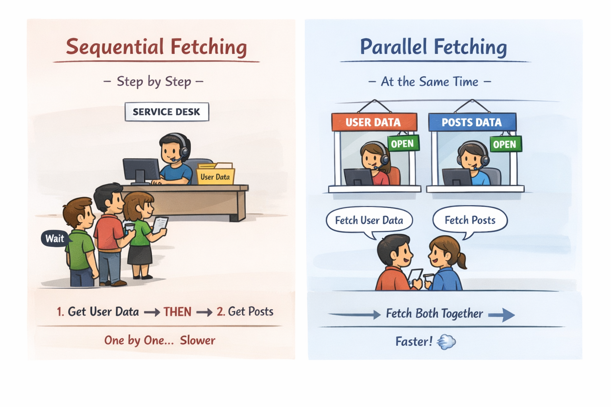

# Async/Await Demo

This project demonstrates how to use async/await to fetch data from an API:
- **Sequential:** Fetch data step by step (slower).
- **Parallel:** Fetch data at the same time (faster).

APIs used:
- Users: https://jsonplaceholder.typicode.com/users/${userId}
- Posts: https://jsonplaceholder.typicode.com/posts?userId=${userId}

